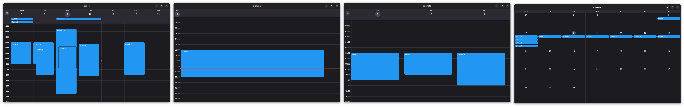
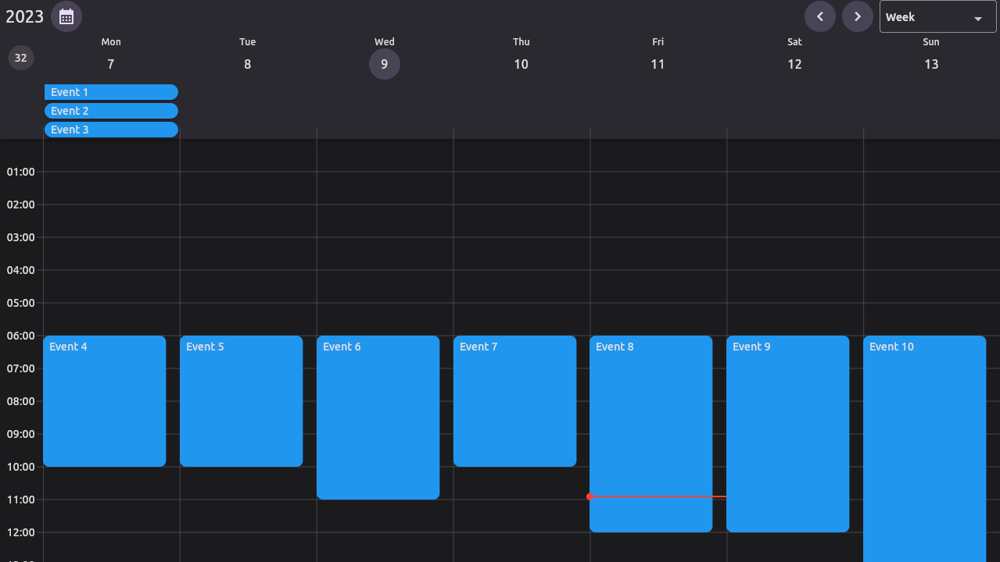

<!--
This README describes the package. If you publish this package to pub.dev,
this README's contents appear on the landing page for your package.

For information about how to write a good package README, see the guide for
[writing package pages](https://dart.dev/guides/libraries/writing-package-pages).

For general information about developing packages, see the Dart guide for
[creating packages](https://dart.dev/guides/libraries/create-library-packages)
and the Flutter guide for
[developing packages and plugins](https://flutter.dev/developing-packages).
-->

<!--
This README describes the package. If you publish this package to pub.dev,
this README's contents appear on the landing page for your package.

For information about how to write a good package README, see the guide for
[writing package pages](https://dart.dev/guides/libraries/writing-package-pages).

For general information about developing packages, see the Dart guide for
[creating packages](https://dart.dev/guides/libraries/create-library-packages)
and the Flutter guide for
[developing packages and plugins](https://flutter.dev/developing-packages).
-->

A Flutter package allows you to use a Calendar Widget that has built-in Day, MultiDay, and Month views. 
It also allows you to customize the appearance of the calendar widget.

## Web Example
Try it out [here](https://049er.github.io/kalender/#/)

## Features

<!--TODO: List what your package can do. Maybe include images, gifs, or videos.-->

* **Calendar Views** - There are 3 calendar views available, Day, MultiDay, and Month. [Find out more](#calendar-views)

  
  (desktop)


  

  (mobile)

*  **Reschedule** - Drag and Drop events to your liking.
    

* **Resize** - Resize events by dragging the edges of an event.
    

* **Event Handeling** - When a there is interaction with a tile or component the event can be handeled by you. [Find out more](#event-handling)

* **Flexible View's** - Each of the Calendar View's takes a ViewConfiguration, this has some parameters you can change, OR you can create your own. [Find out more](#view-configuration)

* **Custom Object** - CaledarEvent's can store any object. [Find out more](#custom-object)

* **Appearance** - You can change the style of the calendar and default components. [Find out more](#appearance)

* **Custom Builders** - You can create your own builders for different components of the calendar. [Find out more](#custom-builders)


## Installation

1. Add this to your package's pubspec.yaml file:
    
    ```
   $ flutter pub add kalender
    ```
2. Import it:   
    
    ```dart
   import 'package:kalender/kalender.dart';
    ```

## Usage

1. Create a custom class to store your data. 
    ```dart
    class Event {
      final String title;
      final Color color;
    
      Event(this.title, this.description);
    }
    ```

2. Create a EventsController
    ```dart
    final eventsController = EventsController<Event>();
    ```
    Add events to the controller
    ```dart
    eventsController.addEvent(
      CalendarEvent(
        dateTimeRange: DateTimeRange()
        eventData: Event(  
            title: 'Event 1',
            color: Colors.blue,
        ),
      ),
    );
    ```

3. Create a CalendarController
    ```dart
    final calendarController = CalendarController();
    ```

4. Create tile builders
   ```dart
   Widget _tileBuilder(event, tileConfiguration) => Widget()
   Widget _multiDayTileBuilder(event, tileConfiguration) => Widget()
   Widget _monthEventTileBuilder(event, tileConfiguration) => Widget()
   ```

5. Create a CalendarView
    ```dart
    CalendarView(
      eventsController: eventsController,
      calendarController: calendarController,
      tileBuilder: _tileBuilder(),
      multiDayTileBuilder: _multiDayTileBuilder(),
      monthTileBuilder: _monthEventTileBuilder(),
    )       
    ```
    


## Additional information

<!--TODO: Complete this-->
### Calendar Views
There are a few constructors that you can choose from to create a CalendarView.

1. **Default Constructor** - this constructor will build the correct view (Day, MultiDay, Month) based on the ViewConfiguration you pass it.

2. **DayView** - this constructor will build a DayView and does not need the monthTileBuilder.

3. **MultiDayView** - this constructor will build a MultiDayView and does not need the monthTileBuilder.

4. **MonthView** - this constructor will build a MonthView and does not need the tileBuilder or multiDayTileBuilder.

### View Configuration
There are 3 'Types' of ViewConfiguration's: DayViewConfiguration, MultiDayViewConfiguration, and MonthViewConfiguration.
* You can create a Custom ViewConfiguration by extending one of these 'Types'.

These are the default ViewConfiguration's:

1. **DayConfiguration** - This configuration is used to configure the SingleDayView.

2. **MultiDayConfiguration** - This configuration is used to configure the MultiDayView and can display any number of days.

3. **WeekConfiguration** - This configuration is used to configure the MultiDayView and displays 7 days that starts on the firstDayOfWeek.

4. **WorkWeekConfiguration** - This configuration is used to configure the MultiDayView and displays 5 days that starts on monday.

5. **MonthConfiguration** - this configuration is used to configure the MonthView.


<!--TODO: Complete this-->
### Event Handling
The CalendarEventHandlers handles the user's interaction with the calendar. (Do not confuse the CalendarEventHandlers with the EventsController)

There are 4 events at this time that can be handeled.

1. **onEventChanged**: this function is called when an event displayed on the calendar is changed. (resized or moved)

2. **onEventTapped**: this function is called when an event displayed on the calendar is tapped.

3. **onCreateEvent**: this function is called when a new event is created by the calendar.

4. **onDateTapped**: this function is called when a date on the calendar is tapped.

```dart
CalendarEventHandlers<Event>(
  onEventChanged: (initialDateTimeRange, event) async {
    // The initialDateTimeRange is the original DateTimeRange of the event.
    // The event is a reference to the event that was changed.

    // This is a async function, so you can do any async work here.
  },
  onEventTapped: (calendarEvent) async {
    // The calendarEvent is a reference to the event that was tapped.

    // This is a async function, so you can do any async work here.
  },
  onCreateEvent: (calendarEvent) async {
    // The calendarEvent is a reference to the event that was created.

    // This is a async function, so you can do any async work here.


    // You must return the calendarEvent.
    return calendarEvent;
  },
  onDateTapped: (date) {
    // The date is the date that was tapped. see example for use case.
  },
);
```

### Events Controller
The EventsController is used to store and manage events.
(Do not confuse the EventsController with EventHandling)

| Function      | Parameters    | Description   |
| ------------- | ------------- | ------------- |
| addEvent      | <!--TODO -->  | <!--TODO -->  |
| addEvents     | <!--TODO -->  | <!--TODO -->  |
| addEvent      | <!--TODO -->  | <!--TODO -->  |
| removeEvent   | <!--TODO -->  | <!--TODO -->  |
| removeWhere   | <!--TODO -->  | <!--TODO -->  |
| clearEvents   | <!--TODO -->  | <!--TODO -->  |
| updateEvent   | <!--TODO -->  | <!--TODO -->  | 


### Calendar Controller
The CalendarController is used to control the CalendarView.

| Function      | Parameters    | Description   |
| ------------- | ------------- | ------------- |
| <!--TODO -->  | <!--TODO -->  | <!--TODO -->  |
| <!--TODO -->  | <!--TODO -->  | <!--TODO -->  |
| <!--TODO -->  | <!--TODO -->  | <!--TODO -->  |
| <!--TODO -->  | <!--TODO -->  | <!--TODO -->  |
| <!--TODO -->  | <!--TODO -->  | <!--TODO -->  |
| <!--TODO -->  | <!--TODO -->  | <!--TODO -->  |
| <!--TODO -->  | <!--TODO -->  | <!--TODO -->  | 


### Custom Object
The CalendarEvent can store any object. This object can be accessed by the tileBuilders and the CalendarEventHandlers.

Custom Object Example:
```dart
CalendarEvent<CustomObject>(
  dateTimeRange: DateTimeRange(),
  eventData: CustomObject(
    title: 'Event 1',
    color: Colors.blue,
  ),
);
```

Tile Builder Example:
```dart
Widget _tileBuilder(CalendarEvent<CustomObject> event, tileConfiguration) {
  final customObject = event.eventData;
  return Card(
    color: customObject.color,
    child: Text(customObject.title),
  );
}
```

### Appearance
The CaledarView takes a CalendarStyle object.
The CalendarStyle is used to change the appearance of the calendar and default components.

| Property      | Type          | Description   |
| ------------- | ------------- | ------------- |
|               |               |               |
|               |               |               |
|               |               |               |


### Custom Builders
The CalendarView takes a CalendarComponents object.
This object containes all the default builders for the calendar, you can override any of these builders to use your own custom builders.

| Property      | Type          | Description   |
| ------------- | ------------- | ------------- |
|               |               |               |
|               |               |               |
|               |               |               |
