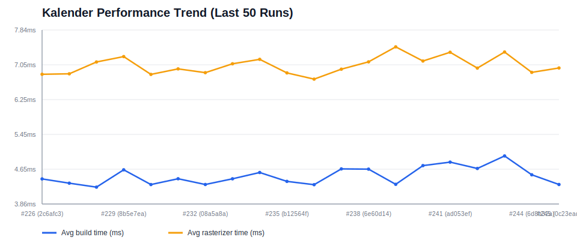

# Performance Results

This branch stores generated performance artifacts from the Kalender profiling workflow.

## Trend Chart (Last 50 Runs)

## Latest Run Summary

| Metric | Value |
|--------|-------|
| Run | #246 (5ef06dc) |
| Timestamp (UTC) | 2026-04-13T09:32:09+00:00 |
| Average frame build time | 4.591886668975625 ms |
| Average frame rasterizer time | 6.733738216067322 ms |
| Missed build budget (total) | 31 |
| Missed rasterizer budget (total) | 31 |
| Scenario count | 24 |

## Latest Comparison Report

- See [performance_comparison.md](performance_comparison.md) for detailed metric-by-metric deltas.

## Recent Runs

| Run | Timestamp (UTC) | Avg Build (ms) | Avg Rasterizer (ms) | Missed Build | Missed Rasterizer |
|-----|------------------|----------------|---------------------|--------------|-------------------|
| #246 (5ef06dc) | 2026-04-13T09:32:09+00:00 | 4.59 | 6.73 | 31 | 31 |
| #245 (0c23ead) | 2026-04-13T07:52:58+00:00 | 4.30 | 6.97 | 29 | 39 |
| #244 (6d8b32a) | 2026-04-13T07:48:20+00:00 | 4.53 | 6.87 | 30 | 31 |
| #243 (75472ae) | 2026-04-13T07:45:54+00:00 | 4.96 | 7.34 | 33 | 48 |
| #242 (aa0ffac) | 2026-04-13T06:40:22+00:00 | 4.67 | 6.97 | 30 | 36 |
| #241 (ad053ef) | 2026-04-11T11:17:34+00:00 | 4.82 | 7.33 | 31 | 52 |
| #240 (4a8f570) | 2026-04-10T14:33:24+00:00 | 4.74 | 7.13 | 31 | 45 |
| #239 (4fee945) | 2026-04-10T14:21:39+00:00 | 4.31 | 7.46 | 26 | 41 |
| #238 (6e60d14) | 2026-04-10T14:18:27+00:00 | 4.66 | 7.11 | 30 | 46 |
| #237 (29b9420) | 2026-04-10T13:57:52+00:00 | 4.66 | 6.95 | 31 | 43 |
| #236 (a0f1140) | 2026-04-10T13:30:06+00:00 | 4.30 | 6.72 | 30 | 27 |
| #235 (b12564f) | 2026-04-10T13:05:57+00:00 | 4.37 | 6.86 | 29 | 38 |
| #234 (c5cb6ad) | 2026-04-02T13:25:47+00:00 | 4.58 | 7.17 | 30 | 40 |
| #233 (d78631b) | 2026-04-02T13:07:23+00:00 | 4.43 | 7.07 | 28 | 41 |
| #232 (08a5a8a) | 2026-04-02T12:11:54+00:00 | 4.30 | 6.87 | 26 | 26 |
| #231 (ee021f0) | 2026-04-02T12:04:19+00:00 | 4.44 | 6.95 | 30 | 38 |
| #230 (ef578cb) | 2026-04-02T11:50:08+00:00 | 4.30 | 6.83 | 26 | 33 |
| #229 (8b5e7ea) | 2026-03-31T10:18:18+00:00 | 4.64 | 7.23 | 29 | 46 |
| #228 (c60fbd2) | 2026-03-31T10:06:48+00:00 | 4.24 | 7.11 | 25 | 29 |
| #227 (fb157bf) | 2026-03-31T08:05:27+00:00 | 4.33 | 6.84 | 28 | 28 |
