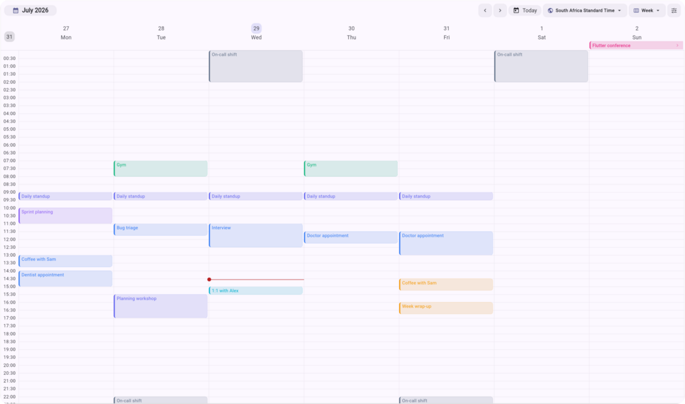
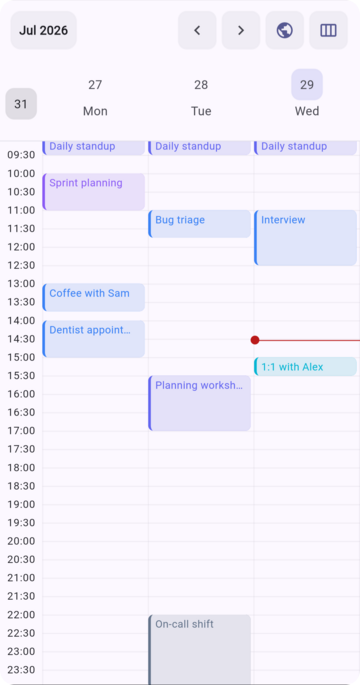
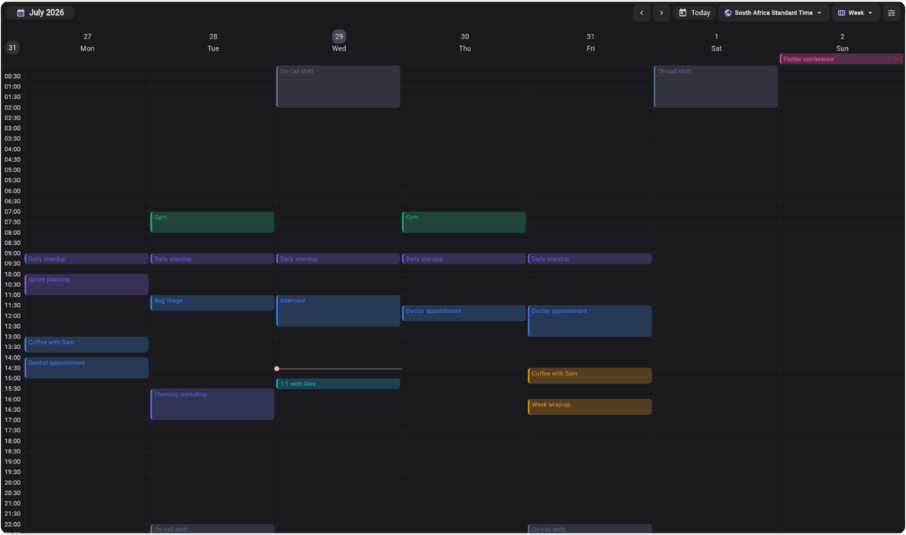
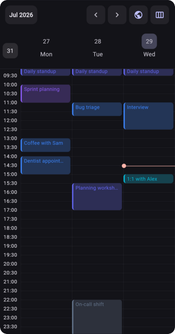

<p align="center">
  
</p>

<p align="center">
  <a href="https://pub.dev/packages/kalender"></a>
  <a href="https://github.com/werner-scholtz/kalender/actions"></a>
  <a href="https://werner-scholtz.github.io/kalender/"></a>
  <a href="https://werner-scholtz.github.io/kalender/dev/bench/"></a>
  <a href="https://opensource.org/licenses/MIT"></a>
</p>

A highly customizable Flutter calendar widget with Day, Multi-day, Month and Schedule views. It supports drag-and-drop rescheduling, event resizing, timezones, and full control over appearance and behavior.

**[Live Demo](https://werner-scholtz.github.io/kalender/)** · **[Benchmarks](https://werner-scholtz.github.io/kalender/dev/bench/)** · **[Migration Guide](MIGRATION.md)**

> [!WARNING]
> This package is still in development, so breaking changes land in minor releases until 1.0.0. The caret range `flutter pub add` writes keeps you on one minor version, which is where fixes land. Every minor bump has an entry in the [migration guide](MIGRATION.md).
>
> If part of the API does not work for you, please [open an issue](https://github.com/werner-scholtz/kalender/issues).

<p align="center">
  
  
</p>
<p align="center">
  
  
</p>

## Features

- **Four views, one widget.** Day, Multi-day, Month and Schedule.
- **Reschedule manually.** Drag, resize and zoom, on mouse, stylus, trackpad or touch.
- **Snapping you control.** To an interval, the time indicator, other events, or your own rule.
- **No fixed event model.** Subclass `KalenderEvent` and read your own fields anywhere.
- **Controllers and callbacks.** Navigate from code, and react to taps, creation and changes.
- **Replaceable, not just configurable.** Swap any widget, or keep it and restyle it.
- **Material 3 by default.** Follows your app's theme with no setup.
- **Timezone aware.** Events stored as UTC, shown in any IANA location. Tested in six timezones.
- **Localized.** Day and month names from intl, and every string replaceable.

## Installation

```bash
flutter pub add kalender
```

If you plan to use [location/timezones](doc/timezones-and-locales.md#location) support, also add:

```bash
flutter pub add timezone
```

If you plan to use [locale](doc/timezones-and-locales.md#locale) support, also add:

```bash
flutter pub add intl
```

---

## Quick Start

The minimal setup, using only the base `KalenderEvent` class with no custom fields:

<!-- snippet: file -->
```dart
import 'package:flutter/material.dart';
import 'package:kalender/kalender.dart';

void main() {
  runApp(const MyApp());
}

class MyApp extends StatelessWidget {
  const MyApp({super.key});

  @override
  Widget build(BuildContext context) {
    return MaterialApp(
      home: Scaffold(body: MyCalendar()),
    );
  }
}

class MyCalendar extends StatefulWidget {
  const MyCalendar({super.key});

  @override
  State<MyCalendar> createState() => _MyCalendarState();
}

class _MyCalendarState extends State<MyCalendar> {
  final eventsController = DefaultEventsController();
  final kalenderController = KalenderController(
    viewConfiguration: MultiDayViewConfiguration.week(
      // Without this the day opens at midnight.
      initialTimeOfDay: const KalenderTime(hour: 7, minute: 0),
    ),
  );

  @override
  void dispose() {
    kalenderController.dispose();
    eventsController.dispose();
    super.dispose();
  }

  @override
  Widget build(BuildContext context) {
    return KalenderView(
      eventsController: eventsController,
      kalenderController: kalenderController,
      callbacks: KalenderCallbacks(
        onEventCreated: (event) => eventsController.addEvent(event),
      ),
      header: KalenderHeader(),
      body: KalenderBody(),
    );
  }
}
```

For a real app you almost always want custom fields on your events. See [Custom Events](doc/events.md#custom-events).

---

## Examples

Runnable apps are in [`examples/`](examples/README.md). Start with
[`example`](examples/example).

---

## Documentation

The detailed guides live in [`doc/`](doc/README.md):

- **[Views](doc/views.md).** The multi-day, month and schedule views, and switching between them.
- **[Events](doc/events.md).** Custom event data, updates through the controller, and multi-day and all-day events.
- **[Interaction](doc/interaction.md).** Creating, rescheduling, resizing, snapping, locking and zoom.
- **[Controllers & Callbacks](doc/controllers-and-callbacks.md).** Navigation, view switching, callbacks and a toolbar.
- **[Appearance](doc/appearance.md).** The theme and the replaceable components.
- **[Layout](doc/layout.md).** Tile placement and custom layout strategies.
- **[Timezones & Locales](doc/timezones-and-locales.md).** Timezones, locales and custom strings.

---

## Contributing

Contributions are welcome. Please open an issue or pull request on [GitHub](https://github.com/werner-scholtz/kalender).

## License

This project is licensed under the MIT License. See the [LICENSE](LICENSE) file for details.
